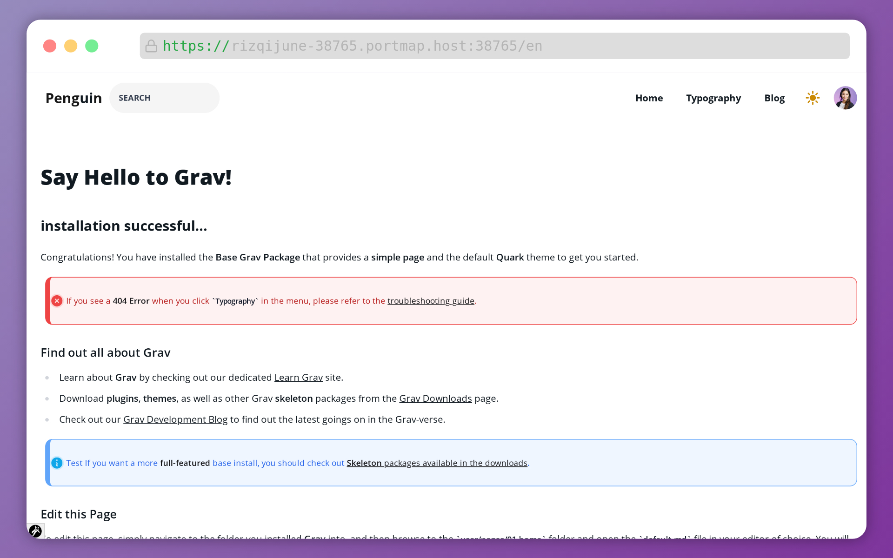

<div align="center">
	
	<br>
	<h1>Prizayu Biz</h1>
	<sub>Crafted with ❤︎ by <a href="https://github.com/rizqijune">rizqijune</a> under the <a href="https://pnya.my.id">PNYA•ID</a></sub>
</div>
<hr/>
<p align="center">✨ <strong>A theme for GravCMS</strong></p>
<h3 align="center"> <strong> NOTE: Recommended for dev only</h3>

<p align="center">
  <!--a href="https://github.com/feross/standard">
    
  </a-->
  <a href="https://opensource.org/licenses/MIT">
    
  </a>
  <a href="https://getgrav.org">
    
  </a>
  <a href="https://tailwindcss.com">
    
  </a>
  <a href="https://alpinejs.dev">
    
  </a>
</p>


# Prizayu Biz Theme 🚀

|  |  |
| ----------------------------- | ------------------------------------------------------------ |


A modern, fast, and customizable theme for startups and small businesses.


> [!CAUTION]
>
> The alpha phase will remain free! so fork  this while its still in public repo.  After released, this repo will only contain production build. The dev build will be available for donator.

## ✨ Features

### For Developers
- 🎨 Integrated Prettier configuration for Twig files
- 🌊 TailwindCSS support for modern, utility-first styling
- ⚡ Alpine.js for lightweight, reactive components
- 📦 Laravel Mix with Webpack for asset compilation
- 🧩 Ready-to-use code snippets
- 📖 Readable code structure (in progress)

### For End Users
- 🧱 Modular theme structure
- 🌓 Dark/Light mode toggle
- 🎯 Custom logo support
- 📝 Professional blog templates
- 🏪 Product showcase functionality
  - List your products
  - Redirect to external stores
  - No built-in payment processing
  - Integrate with [Sell.app](https://sell.app) (Possibility)
- 💬 Custom comment system (in progress)
- 📱 Mobile-first design approach
- 🔍 SEO optimized
- 🚀 Fast loading speeds
- 📊 Analytics ready
- 🌐 Multi-language support
- 📧 Contact form integration
- 🔒 Security best practices
- 🎯 Call-to-action sections

## 📥 Installation

1. Download the theme:
   ```bash
   cd user/themes/
   git clone https://github.com/rizqijune/prizayu-biz.git
   ```

2. Activate the theme in Grav:
   - Navigate to `Admin Panel > System > Theme`
   - Select "Prizayu Biz"
   - Save changes

## 🛠️ Development Setup

1. Configure VSCode:
   ```json
   {
     "editor.formatOnSave": true,
     "prettier.configPath": ".prettierrc"
   }
   ```

2. Start development server:
   ```bash
   yarn dev
   ```

3. Build for production:
   ```bash
   yarn prod
   ```

## 📋 To-Do List

Take a look at this : https://pnyaid.blogspot.com/p/prizayu-roadmap.html

## 💰 Support Development

If you find this theme helpful, consider supporting its development with crypto:

- EVM (ETH, POL, BNB) : [rizqijune.nft](https://ud.me/rizqijune.nft)
- NEAR :  SOON
- TON :  SOON

## 📄 License

This project is open source and available under the [MIT License](LICENSE).

```
MIT License

Copyright (c) 2024 PNYA•ID

Permission is hereby granted, free of charge, to any person obtaining a copy
of this software and associated documentation files (the "Software"), to deal
in the Software without restriction, including without limitation the rights
to use, copy, modify, merge, publish, distribute, sublicense, and/or sell
copies of the Software, and to permit persons to whom the Software is
furnished to do so, subject to the following conditions...
```

## 🤝 Contributing

Contributions, issues, and feature requests are welcome! Feel free to check the [issues page](link-to-issues).

## 📞 Support

Need help? You can:
- Open an issue on GitHub